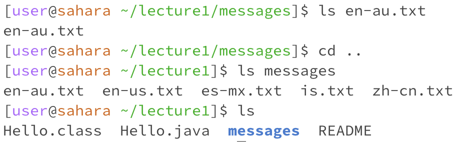
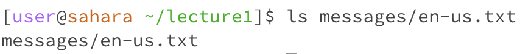
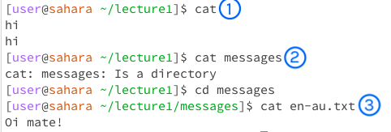

# Remote Access and FileSystem (Week 1)
In this lab report, I use the lecture1 folder provided as my example. The circled numbers in each image corresponds to the numbered finding in each cd, ls, and cat category.
## cd command
1. Calling the command 'cd' with no arguments returns nothing. The current working directory when this command was run is /home. Because  no arguments were included as a directory, the command returns nothing, which is the expected output. However, it actually is taking us back to the home directory. For example, if I were to cd into lecture1 then cd into messages, calling the cd command with no arguments returns me back to /home.
2. Prior to calling the command, the current working directory is /home. Calling the command 'cd' with 'lecture1' as its argument changes the directory of the file and accesses the lecture1 folder. This is expected as cd is supposed to go into the directory its argument assigns (if it's the subsequential directory after the previous). Therefore, it is not an error.
3. Prior to calling the command, the current working directory is /home/lecture1. Calling the command 'cd' with the file 'en-au.txt' as its argument produces an error message of "No such file or directory." because  the directory at the time of running the command is in lecture1 and not the 'messages' folder that has the file. However, even if cd was in the correct dirctory, there'd still be an error message because the 'cd' command isn't meant to access files.

## ls command
1. Prior to calling the command, the current working directory is /home. Calling the command 'ls' with no arguments returns 'lecture1'. This is expected as it is the name of the folder within the home directory. The command outputs the contents of the directory its in. In this case, the contents of the home directory is just the lecture1 folder so, the output isn't an error.
2. Prior to calling the command, the current working directory was /home. Calling the command 'ls' with 'lecture1' as its argument returns the contents in the lecture1 folder, both files and folders, despite not being in the lecture1 working directory. The output behaves as it should by including every file and folder in the lecture1 folder, hence it is not an error. However, the arguments used after ls must already be in the folder of the working directory like the /home directory holding the lecture1 folder. It's unable to reach within a folder of a folder unless it gets cd'd into.
3. Prior to calling the command, the current working directory was /home/lecture1/messages. Calling the command 'ls' with the file 'en-au.txt' as its argument returns the name of the file which is expected since the 'ls' command is meant to return the names of files and folders in the current directory. Additionally, if the working directory was /home/lecture1 and the ls command was called with messages/en-us.txt as its argument, the terminal returns the path used in the argument: messages/en-us.txt which is interesting.

The following images correspond to 3.

## cat command
1. Prior to calling the command, the current working directory is /home/lecture1. Calling the command 'cat' with no arguments outputs back what the user typed until the user exits out of it. This is expected behavior since the 'cat' command with no arguments will repeat back what is inputed. This could be because the 'cat' command is meant to output the contents of folders and files, and if there's no arguments for the terminal to access, it accesses its own inputs.
2. Calling the command 'cat' with directory as an argument will output whether the argument is a directory or not. The working directory at the time of running the command is lecture1. I used 'messages' as an argument, resulting in the terminal outputting that the 'messages' folder is a directory. This is an error.
3. Prior to calling the command, the current working directory is /home/lecture1/messages. Calling the command 'cat' with a file as its argument outputs the content of the file. I used en-au.txt as an example, and as a result, the content, 'Oi mate!' in the file is outputted. Because the directory was in the messages folder, no error was outputted and the command was able to access the txt file. This works as it should as one of the functions of the 'cat' command is to output what the contents of the file are. 

