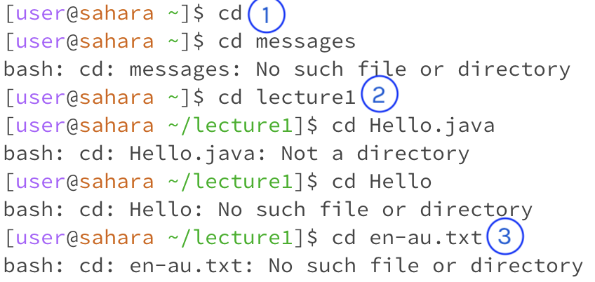
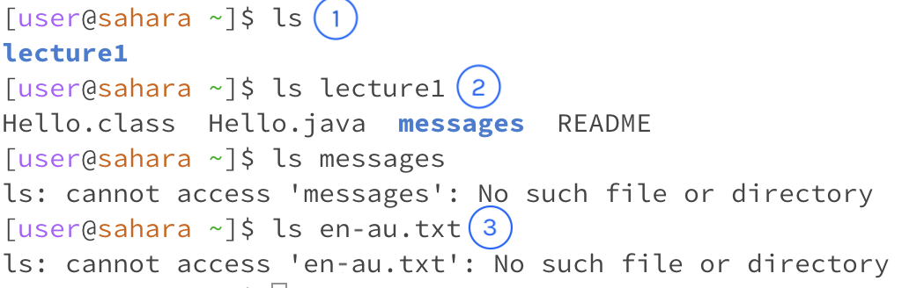

# Remote Access and FileSystem (Week 1)
In this lab report, I use the lecture1 folder provided as my example. The circled numbers in each image corresponds to the numbered finding in each cd, ls, and cat category.
## cd command
1. Calling the command 'cd' with no arguments returns nothing. The current working directory when this command was run is nothing. Because  no arguments were included as a directory, the command returns nothing, which is the expected output.
2. Calling the command 'cd' with 'lecture1' as its argument changes the directory of the file and accesses the lecture1 folder. This is expected as cd is supposed to go into the directory its argument assigns (if it's the subsequential directory after the previous). Therefore, it is not an error.
3. Calling the command 'cd' with the file 'en-au.txt' as its argument produces an error message of "No such file or directory." because  the directory at the time of running the command is in lecture1 and not the 'messages' folder that has the file. However, even if cd was in the correct dirctory, there'd still be an error message because the 'cd' command isn't meant to access files.

## ls command
1. Calling the command 'ls' with no arguments returns 'lecture1'. This is expected as it is the name of the current directory at the time of running the command. The command outputs the directory its in. Because the command is working as it should, the output isn't an error.
2. Calling the command 'ls' with 'lecture1' as its argument returns the contents in the lecture1 folder, both files and folders. At the time of calling the command, the working directory is lecture1. The output behaves as it should by including every file and folder in the lecture1 folder, hence it is not an error.
3. Calling the command 'ls' with the file 'en-au.txt' as its argument produces an error and is unable to access the file because the working directory is in lecture1 and not the messages folder that holds the file. However, when the terminal cd's into the messages directory, the terminal returns the file's name which is expected since the 'ls' command is meant to return the names of files and folders  in the current directory.

## cat command
1. Calling the command 'cat' with no arguments outputs back what the user typed until the user exits out of it. This is expected behavior since the 'cat' command with no arguments will repeat back what is inputed. This could be because the 'cat' command is meant to output the contents of folders and files, and if there's no arguments for the terminal to access, it accesses its own inputs.
2. Calling the command 'cat' with arguments will output the contents of the files or folder that the argument is.
3. 

