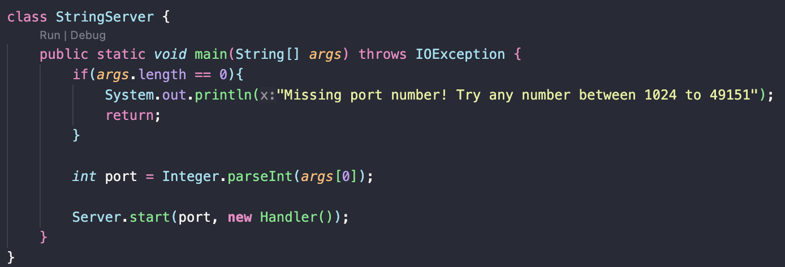

# Lab Report 2 - Servers and SSH Keys (Week 3)
## Part 1

I called one method in my code which is called 'handleRequest.' I also have a class called StringServer which creates the server for the website and intakes a port number. This port value can change based on what the user decides to input and affects which port is used inside the localhost url. The handleRequest method takes in a url link and looks for the '/add-message' path and 's=____' query. The relevant values of this method are the strings that can added to the website list based on it being written inside the query. With these components, the website should show [Number of order it was added]. [user inputted string]. The number of the order it was added is incremented by 1 each time a new string is added to the list.  

Like previously said, I use the handleRequest method whose arguments takes in the URI url of my localhost. The relevant values of this method is the path and query. For example, the image shows '1. hello' where the inputted url was localhost:1300/add-message?s=hello. 1300 is the port number I used to open my server. '/add-message' is the path and 's=hello' is the query. The values of the url that change based on a specific request is the query after 's='. The /add-message path shouldn't change since any strings that get added to the website will use the same path. In this case, 'hello' is added to the list based on being inputted in the query.  

Like previously said, I use the handleRequest method whose arguments takes in the URI url of my localhost. The relevant values of this method is the path and query. This image shows '2. how are you' after changing the query to 's=how are you'. It gets added onto the existing list created from the previous 'hello' query and increments the count by 1 for each string added. In this case, the query input is 'how are you.' The values of the url that change based on a specific request is the query after 's='. The /add-message path shouldn't change since any strings that get added to the website will use the same path.

## Part 2
**Private Key:**  

**Public Key:**  

**Log Into ieng6 Without Password:**  

## Part 3
I learned a lot of terminal commands in week 2 and 3 that have been very useful for finding paths. I think the most useful commands I learned have been 'cd' and 'pwd'.  They're definitely helpful when trying to figure out what working directory you're in or need to enter. For example, I began to use them outside of CSE 15L for my CSE12 class whenever I get "unable to find file/directory" errors in my terminal. 
