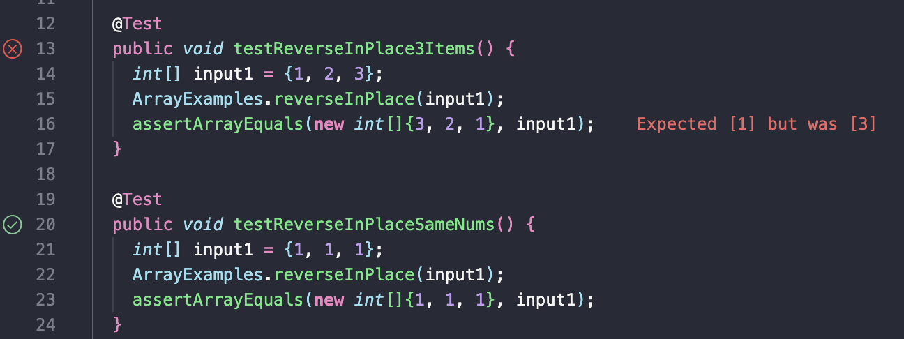

## Part 1 - Bugs
When testing with JUnit, the program would not properly reverse the elements of the list in both the `reversed` and `reversedInPlace` methods. For this example, I'll refer to the `reversedInPlace` method. A failure-inducing input for the buggy program from week 4's lab was as simple as a regular list such as `{1, 2, 3}`. The code for the `reversedInPlace` method prior to fixing and my test follows:  
```
static void reverseInPlace(int[] arr) {
    for(int i = 0; i < arr.length; i += 1) {
      arr[i] = arr[arr.length - i - 1];
    }
  }

@Test 
public void testReverseInPlace3Items() {
    int[] input1 = {1, 2, 3};
    ArrayExamples.reverseInPlace(input1);
    assertArrayEquals(new int[]{3, 2, 1}, input1);
}
```
This test resulted in an incorrectly ordered list error where the last element was '3' when it should've been '1'.  

```
  @Test 
	public void testReverseInPlaceSameNums() {
    int[] input1 = {1, 1, 1};
    ArrayExamples.reverseInPlace(input1);
    assertArrayEquals(new int[]{1, 1, 1}, input1);
	}
```  
However, the input of a list with the same element value passes the test such as `{1, 1, 1}`. This is because the list element values remain the same regardless of if it was actually reversed or not. Below is the JUnit results of both the failing and passing test which are the symptoms of the buggy code:  
  
The reversedInPlace method is implemented incorrectly as tt doesn't properly reverse the elements of a list. The bug of this code is that it updates the elements at the end of the list without storing the previous elements anywhere. Since it does this, the old elements get erased from the list altogether and is unable to be accessed. To fix this issue, we can create a temporary array to store the old elements of the given array and use that to change the values of the given array into reverse order.  
  
#### Before fixing bug:  
```
static void reverseInPlace(int[] arr) {
    for(int i = 0; i < arr.length; i += 1) {
      arr[i] = arr[arr.length - i - 1];
    }
  }
```  
#### After fixing bug:  
```
  static void reverseInPlace(int[] arr) {
    int[] temp = new int[arr.length];
    for (int i = 0; i < arr.length; i++) {
      temp[i] = arr[i];
    }
    for(int i = 0; i < arr.length; i += 1) {
      arr[i] = temp[arr.length - i - 1];
    }
  }
```  
The updated code fixes the issue because it uses a temporary array to store the original elements, then updates the elements of the array from the end of the temp array. This way, no elements get lost when reversing the original array.   

## Part 2 - Researching Commands  
I explored the `grep` command and found that there's a multitude of different ways to use it. The basic syntax for `grep` is usually `grep [option] pattern [files]`. I used GeeksForGeeks - grep command in Unix/Linux (https://www.geeksforgeeks.org/grep-command-in-unixlinux/) as guidance for each of my examples below.  
#### grep -c
One function of `grep` is that it can count the amount of lines in a file that contains certain words by using `-c` in the terminal. For example, I called `grep -c "DNA" technical/biomed/*.txt` to search for the amount of lines per file that contained the word "DNA". This outputted each file in the biomed directory and how many lines contained "DNA" per file.  
  
```
Terminal Input:  
grep -c "DNA" technical/biomed/*.txt  

Output:
...
technical/biomed/1471-2091-2-12.txt:1
technical/biomed/1471-2091-2-13.txt:5
technical/biomed/1471-2091-2-16.txt:0
technical/biomed/1471-2091-2-5.txt:12
technical/biomed/1471-2091-2-7.txt:1
technical/biomed/1471-2091-2-9.txt:0
technical/biomed/1471-2091-3-13.txt:97
technical/biomed/1471-2091-3-14.txt:20
...
```
(I use "..." to show there were more files part of the output but not shown in the example).  
  
Another example of calling the `grep -c` command is I searched for the amount of lines contained the word "science" in a specific file. I called `grep -c "science" technical/plos/journal.pbio.0020001.txt`. This outputted `16` as the word "science" appeared in 16 lines of the `journal.pbio.0020001.txt` file.  
  
```
Terminal Input:
grep -c "science" technical/plos/journal.pbio.0020001.txt
  
Output:  
16
```
Overall, `grep -c` can be useful if a user wants to know how many times a word or sentence appeared in a file. It can also be used as a way to filter files. If a file doesn't have the keyword a user is looking for, then they can ignore that file since it appears 0 times.  
  
#### grep -l  
`grep` can also show you files that contain certain keywords with its `-l` command. For example, I called `grep -l "mice" technical/biomed/*.txt` to search for text files that contained the word "mice" in them. This outputted a list of text files within the biomed directory.
```
Terminal Input:
grep -l "mice" technical/biomed/*.txt  
  
Output:  
technical/biomed/1471-2091-2-16.txt
technical/biomed/1471-2091-2-5.txt
technical/biomed/1471-2091-3-14.txt
technical/biomed/1471-2091-3-30.txt
technical/biomed/1471-2091-3-31.txt
technical/biomed/1471-2091-3-8.txt
technical/biomed/1471-2105-3-17.txt
technical/biomed/1471-2105-3-4.txt
...
```
I also wanted to test out the `-l` command with multiple words to see if strings of words also can get filtered and found in files, which it does. For example, I wanted to find files that were about or related to Charles Darwin in the plos directory. This outputted four journal text files that had his name in them.

```
Terminal Input:
grep -l "Charles Darwin" technical/plos/*

Output:  
technical/plos/journal.pbio.0020046.txt
technical/plos/journal.pbio.0020311.txt
technical/plos/journal.pbio.0020347.txt
technical/plos/journal.pbio.0020439.txt
```
Overall, `grep -l` can be useful for finding files with certain keywords since it acts as a filter based on what string the user inputs to find within their files.  

#### grep -w  
Another function of `grep` is `-w` which will show you the contents of files with the keyword given. For example, I called `grep -w "Charles Darwin" technical/plos/*` to find where "Charles Darwin" appeared in the text files of the plos directory.  
```
Terminal Input:
grep -w "Charles Darwin" technical/plos/*
Output:  
technical/plos/journal.pbio.0020046.txt:        answers to possible questions and criticisms to avoid stutteri
ng. Charles Darwin also                                                                                       technical/plos/journal.pbio.0020311.txt:        out by Charles Darwin and his son Francis in 1880. The Darwins
 were able to demonstrate                                                                                     technical/plos/journal.pbio.0020347.txt:        described by Charles Darwin (1859).
technical/plos/journal.pbio.0020439.txt:        location within the head (Hsieh 2003). Charles Darwin was righ
t when he wrote that people
```                                         

I also wanted to test it out with just a specific file:
```
Terminal Input:
grep -w "mice" technical/biomed/rr74.txt

Output:
        using mice that are deficient in NOS isoforms.
        vascular tone. Studies using knockout mice for each of
        hypertension in mice that lack eNOS [ 9, 12]. In the
        present study we exposed wild-type mice to severe hypobaric
          ME, USA) mice at age 6 weeks.
          Briefly, mice were anesthetized with ketamine/xyalazine
        lung expression of eNOS and possibly iNOS in mice with
        The pulmonary hypertension in mice exposed to hypoxia
        Despite the increase in eNOS, however, the mice developed
        detection in the lungs of hypoxic, hypertensive mice.
        protein, using several different antibodies, in mice. This
        iNOS protein levels in adult mice following hypoxia was
        hypoxia. We have recently reported that mice deficient in
        in mice following hypoxia. Increased nNOS has been
        coronary circulation of eNOS-deficient mice, but its role
        Although we attempted to keep the mice continuously
        lung following hypoxia in mice is presently unknown.
        considering studies using NOS-deficient mice. The present
        study also suggests that exposure of neonatal mice to
        that observed in mature mice exposed to hypoxia, and this
```
Interestingly, the command with a specific file showed a much larger chunk of text where "mice" was used in comparison to looking at multiple files with a keyword, like in the previous example, where only a small amount of text was shown per file.  
Overall, `grep -w` lets you know where a given keyword is used in the text files. This can be helpful if you're trying to search for certain keywords in a file and where specifically they appear in the file.  

#### grep -wc  
For my last examples, I combined `grep` and the word count command from lecture and used it as `grep -wc` to see what it would output. Below, I inputted `grep -wc "mice" technical/biomed/rr74.txt`. I used the same file from the previous "mice" example and `-wc` outputted 20. I discovered that `grep -wc` would return the amount of times that specific keyword appeared in the file since "mice" appears 20 times in the rr74.txt file.
```
Terminal Input:
grep -wc "mice" technical/biomed/rr74.txt

Output:
20
```
Then I wanted to test it out for the entire biomed directory rather than just a specific file. I inputted `grep -wc "mice" technical/biomed/*`.  
  
```
Terminal Input:
grep -wc "mice" technical/biomed/*

Output:
...
technical/biomed/1471-2091-2-12.txt:0
technical/biomed/1471-2091-2-13.txt:0
technical/biomed/1471-2091-2-16.txt:4
technical/biomed/1471-2091-2-5.txt:1
technical/biomed/1471-2091-2-7.txt:0
technical/biomed/1471-2091-2-9.txt:0
technical/biomed/1471-2091-3-13.txt:0
technical/biomed/1471-2091-3-14.txt:4
...
```  
Overall, I think `grep -wc` works very similarly to the `grep -c` command since they both find the amount of times a keyword appears in a file. Because of this, I think `grep -wc` would have the same usefulness as `grep -c` where a user can check how many times a word or sentence appeared in a file. This can be used as a way to filter files. If a file doesn't have the keyword a user is looking for, then they can ignore that file since it appears 0 times.  
