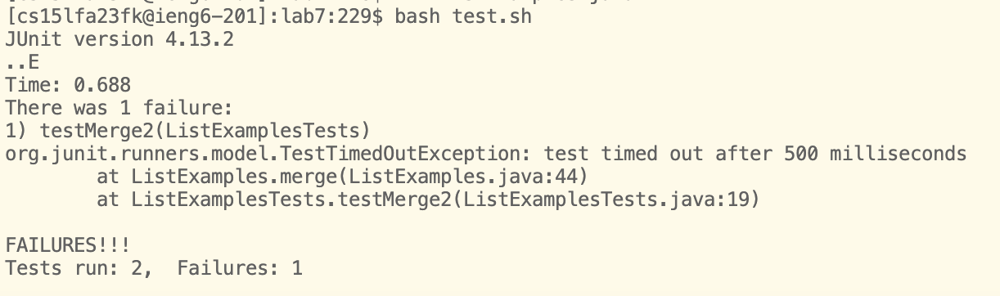

## Lab Report 4  
It took me about 10 minutes according to the timer.  
  
### Step 4: Log into ieng6  
To begin, I wanted to log into the ieng6. In the terminal, I typed in `s` `s` `h` `<Space>` `c` `s` `1` `5` `l` `f` `a` `2` `3` `f` `k` `@` `i` `e` `n` `g` `6` `.` `u` `c` `s` `d` `.` `e` `d` `u` and pressed `<Enter>` to log into ieng6. After a little bit, it automatically loggged me in without requiring a password.
  
  

### Step 5: Clone your fork of the repository from your Github account (using the SSH URL)  
Next, I cloned a fork of my repository and copied the ssh link by clicking the clipboard. Then in my terminal, I typed in `g` `i` `t` `<Space>` `c` `l` `o` `n` `e` `<Space>` `Cmd+V` which pasted `git@github.com:iccxu/lab7.git`. Then I pressed `<Enter>` into the terminal to finalizae the command and it began cloning into my ieng6 account.  
  
  

### Step 6: Run the tests, demonstrating that they fail  
Afterwards, I typed `c` `d` `<Space>` `l` `a` `b` `7` `<Enter>` to get into the directory of the lab7 file. Then I typed `b` `a` `s` `h` `<Space>` `t` `e` `s` `t` `.` `s` `h` `<Enter>` to run the tests of the ListExamples files. Upon doing so, I received a failure of one of the tests.  
  
  
** Note: I begin to put words into one code block chunk but they still refer to the format of individual key presses. For example: `vim` = `v` `i` `m`.  
### Step 7: Edit the code file to fix the failing test  
I started off by fixing the `ListExamples.java` file. To fix the code, I entered `vim` `<Space>` ListExamples.java`. Then I typed `/index1` to search for the first occurrence of `index1` in the code and then pressed `<enter>`. Afterwards, I typed `<n>` until I reached the last while loop. Then I typed `<i>` to enter insert mode and I pressed the `<right>` key 6 times until I reached the end of `index1`. Then, `<backspace>, <2>, <esc>, <:><w>` to change `index1` to `index2` and saved using the `:w` command in vim.  
  
  

### Step 8: Run the tests, demonstrating that they now succeed  
I ran `bash test.sh` once again and all the tests passed.  
  
  

### Step 9: Commit and push the resulting change to your Github account (you can pick any commit message!)  
Afterwards, I typed in `git add ListExamples.java` to add the file to my workspace. Then `git status` to see what was in the current workspace. I typed in `git commit` to commit the changes and added a message. Once I finished, I typed in `:wq` to save and quit the changes of my commit message then `git push` to push the file into the GitHub server.  
  

