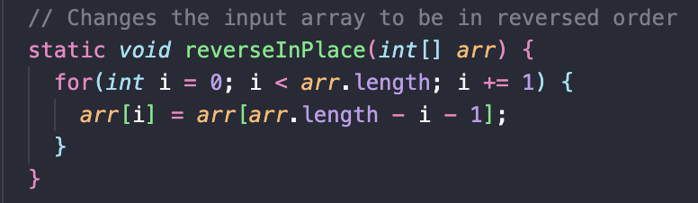
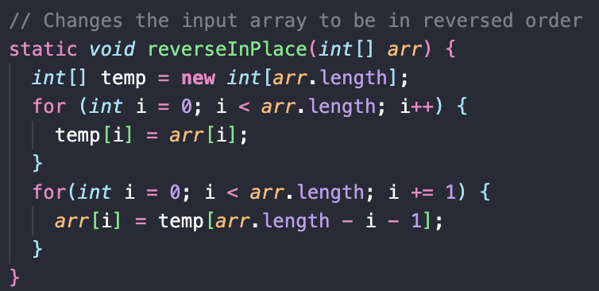
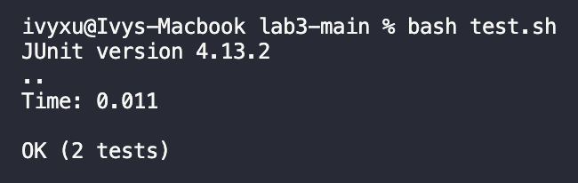

# Lab Report 5
## Part 1 - Debugging Scenario
#### Edstem.org  
***	 
**AnonymousWhale**:  
Hello! I'm having issues with my `ArrayExamples.java` code. I'm trying to reverse a list but it's not properly reversing a normal list. Here is my code and test prior to fixing the bug:  
  
  
I tested it out by running `bash test.sh` where the contents of the `test.sh` file was:  
```
javac -cp .:lib/hamcrest-core-1.3.jar:lib/junit-4.13.2.jar *.java
java -cp .:lib/hamcrest-core-1.3.jar:lib/junit-4.13.2.jar org.junit.runner.JUnitCore ArrayTests
```  
The test results in `1` being the first element of the list when it should be `3`. How would I fix this?  
  
**FantasticTA:**  
Hi, it seems like you're trying to modify the original array. Since you're reversing each element within the same Arraylist, the old elements where the last index is, is not being stored anywhere prior to getting changed. So as you modify each element in the front with the elements in the back, you eventually lose all the original elements at the end of the list. Could you do anything that would keep track of the original elements prior to reversing them?  
  
**AnonymousWhale:**  
Oh I see! So I should use a temporary array to store the original elements and then use that to reverse the original array?  
  
**FantasticTA:** Correct! Could you show me your implementation of that?  
  
**AnonymousWhale:**   
I created a temporary array to store the contents of the original array. Then I iterated through the temporary array and set each index of the original array to the elements in the temporary array but in backwards order so the original array gets reversed. Then I tested it out again and ran `bash test.sh`. My code works! Thank you.  
Here is my code after fixing the bug:   
   
The bash test:  
  

## Part 2 – Reflection
In a couple of sentences, describe something you learned from your lab experience in the second half of this quarter that you didn’t know before. It could be a technical topic we addressed specifically, something cool you found out on your own building on labs, something you learned from a tutor or classmate, and so on. It doesn’t have to be specifically related to a lab writeup, we just want to hear about cool things you learned!

I found it cool when we learned bash scripting because it gives you the ability to run multiple terminal commands at once just by running one command. For example, bash script makes it easier to run tests. Since you can just type a command to compile every `.java` file and then another command to run each JUnit test into the bash file, all you have to do to run both commands is type in `bash [file name].sh`. You could also write code in bash that will run based on the conditionals or arguments you pass in with `$1, $2` etc... Overall, I thought it was neat with how much you can do with bash and bash scripting.
