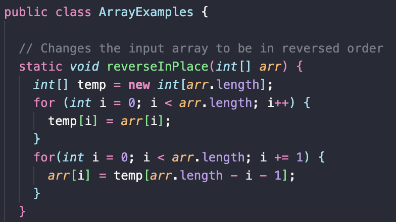
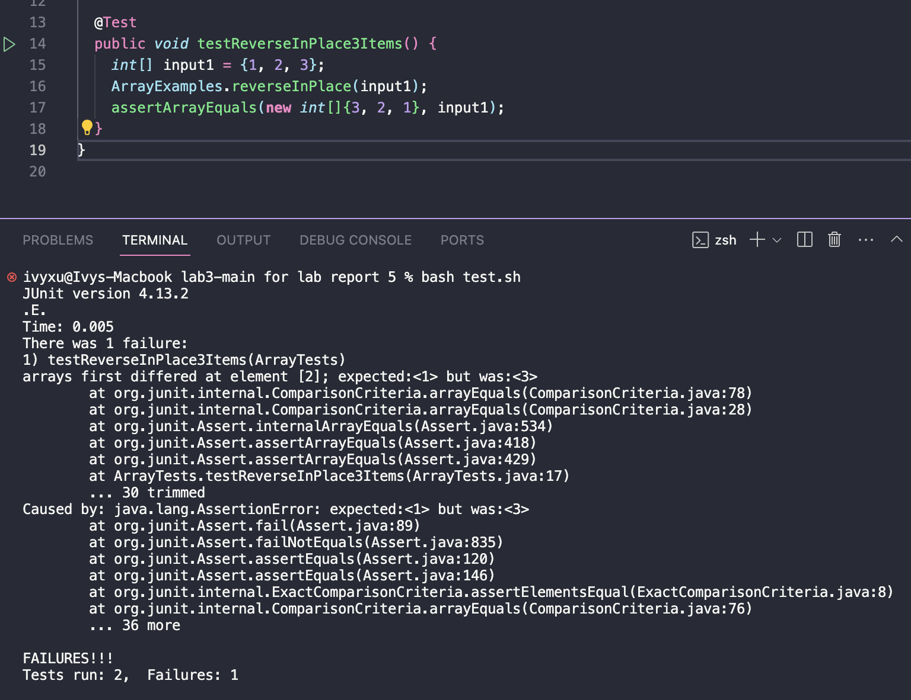

Part 1 – Debugging Scenario
Design a debugging scenario, and write your report as a conversation on EdStem. It should have:

The original post from a student with a screenshot showing a symptom and a description of a guess at the bug/some sense of what the failure-inducing input is. (Don’t actually make the post! Just write the content that would go in such a post)
A response from a TA asking a leading question or suggesting a command to try (To be clear, you are mimicking a TA here.)
Another screenshot/terminal output showing what information the student got from trying that, and a clear description of what the bug is.
At the end, all the information needed about the setup including:
The file & directory structure needed
The contents of each file before fixing the bug
The full command line (or lines) you ran to trigger the bug
A description of what to edit to fix the bug
You should actually set up and run the scenario from your screenshots. It should involve at least a Java file and a bash script. Describing the bug should involve reading some output at the terminal resulting from running one or more commands. Design an error that produces more interesting output than a single message about a syntax or unbound identifier error – showcase some interesting wrong behavior! Feel free to set this up by cloning and breaking some existing code like the grading script or code from class, or by designing something of your own from scratch, etc.

## Part 1 - Debugging Scenario
#### Edstem.org  
***	 
AnonymousWhale:  
Hello! I'm having issues with my `ArrayExamples.java` code. I'm trying to reverse a list but it's not properly reversing a normal list. Here is my code and test:  
  
  
I tested it out by running `bash test.sh` where the contents of the `test.sh` file was:  
```
javac -cp .:lib/hamcrest-core-1.3.jar:lib/junit-4.13.2.jar *.java
java -cp .:lib/hamcrest-core-1.3.jar:lib/junit-4.13.2.jar org.junit.runner.JUnitCore ArrayTests
```  
The test results in `1` being the first element of the list when it should be `3`. How would I fix this?  
  
FantasticTA:  
Hi, it seems like you're trying to modify the original array. Since you're reversing each element within the same Arraylist, the old elements where index 0 is, is not being stored anywhere. Could you do anything that would keep track of the original elements prior to reversing them?  
  
AnonymousWhale:  
Oh I see! So I could use a temporary array to store the original elements and then use that to reverse the original array?  
  
FantasticTA: Correct! Could you show me your implementation of that?  
  
AnonymousWhale:  
I did this: 
